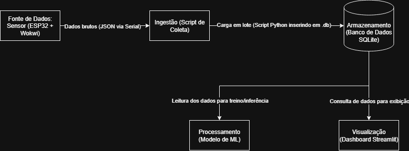

# Projeto Final: Pipeline de Dados e ML para Monitoramento Industrial

## Integrantes
* Luis Fernando dos Santos Costa - RM565285
* Lucas Medeiros Leite - RM564892
* Richard Seberino Marques - RM563313
* Douglas de Souza Felipe - RM561335
* Mariana Cavalcante Oliveira - RM561678

## Vídeo de Demonstração
A demonstração completa do projeto em funcionamento está disponível no YouTube:

**Link do Youtube : Ainda em Andamento!!!**

## Visão Geral
Este projeto implementa um pipeline de dados fim-a-fim, conforme solicitado no Challenge da FIAP em parceria com a Hermes Reply. O objetivo é simular o monitoramento de um motor industrial, coletando dados de sensores, armazenando-os, treinando um modelo de Machine Learning para detecção de anomalias (temperatura > 40°C) e, por fim, exibindo os resultados em um dashboard interativo com um sistema de alertas em tempo real.

## Arquitetura
O diagrama abaixo ilustra o fluxo completo de dados, desde a fonte simulada (ESP32 no Wokwi) até a camada de visualização para o usuário final.



## Como Executar o Projeto

**Pré-requisitos:**
- Python 3.8+
- Git

**1. Clone o repositório:**
```bash
git clone [https://github.com/LyxCosta/Fiap-Sprint-4-Reply](https://github.com/LyxCosta/Fiap-Sprint-4-Reply)
cd Fiap-Sprint-4-Reply